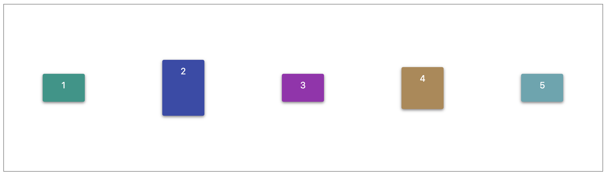

# Elm Flex-Layout

Elm Flex Layout provides a layout API for using Flexbox CSS. This module provides Elm developers with layout features using a custom Layout API.

Elm Flex Layout automates the process of applying appropriate Flexbox CSS to browser view hierarchies.

### Getting started

#### Installing the package

```
$ elm install tptshepo/elm-flex-layout
```

### Usage

#### fxLayout



```elm
import Flex
...
...
...
view =
  div ([] ++ fxLayout Flex.row Flex.spaceAround Flex.center)
      [ div [] [text "1"]
      , div [] [text "2"]
      , div [] [text "3"]
      , div [] [text "4"]
      , div [] [text "5"]
      ]
...
...
```

Direction options

```elm
row
column
```

Horizontal and vertical alignment options

```elm
start
center
end
spaceBetween
spaceAround
spaceEvenly
stretch
```
